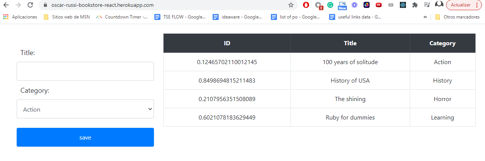

# Bookstore-react

Fifth milestone of the Bookstore React Project, for Microverse academy, By Oscar Russi

# What it does

- Cloned the required design available in Zeplin: [Bookstore Design](https://cdn.zeplin.io/5b35a9e13227086040f8eb75/screens/C4825D1D-4395-448F-9640-44B9775F3B1B.png).
- Created BookHeader component for the header of the page.
- Created Ring component for the ring progress bar to use in the list of books.
- Modified redux states, actions and reducers for the new book attributes.

# Build with

- [React](https://reactjs.org/)
- [Webpack](https://webpack.js.org/)
- [npm](https://www.npmjs.com/)
- [Heroku](https://www.heroku.com/)
- [Redux](https://redux.js.org/)

# Live demo

[Live Demo](https://oscar-russi-bookstore-react.herokuapp.com/)

# How to run this project

- Download this project or install running the next command in the terminal: https://github.com/andresporras3423/bookstore-react.git
- Move to the folder bookstore-react
- In the terminal, run: npm install
- In the terminal, run: npm start

#### and deployed to GitHub

## Authors

**Oscar Russi**
- Github: [@andresporras3423](https://github.com/andresporras3423/)
- Linkedin: [Oscar Russi](https://www.linkedin.com/in/oscar-andres-russi-porras)

## � Contributing

This is a project for educational purposes only. We are not accepting contributions.

## Attributions and Credit

Special thanks to Microverse, for this learning opportunity. 

## Show your support

Give a ⭐️ if you like this project!

## Enjoy!